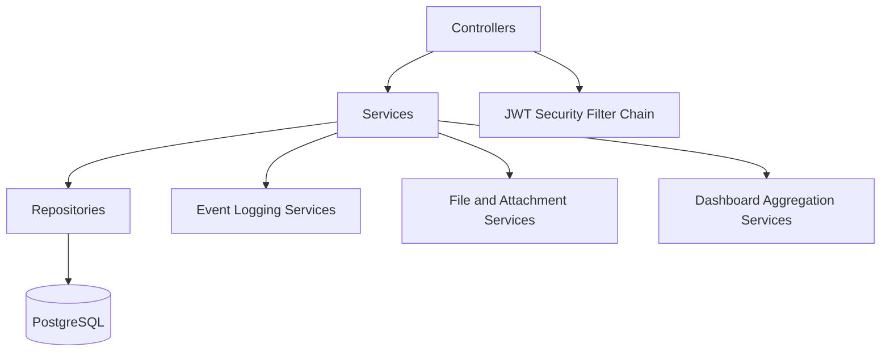
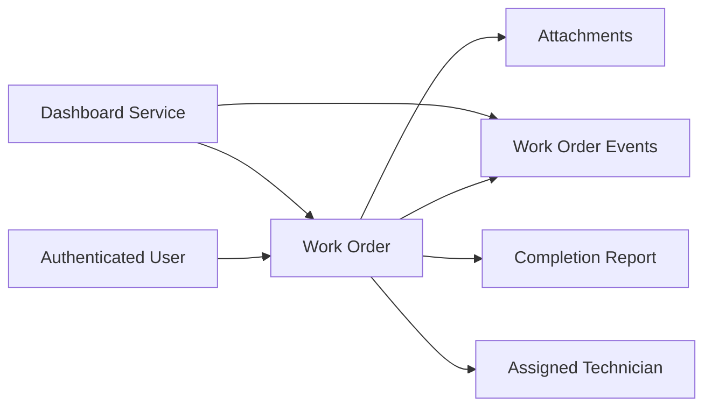
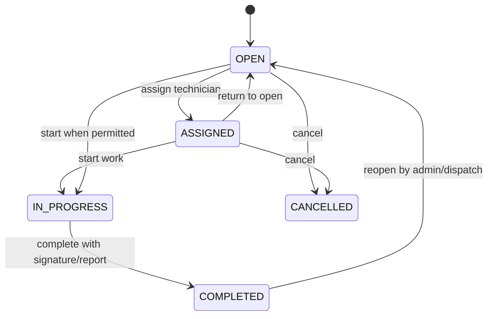
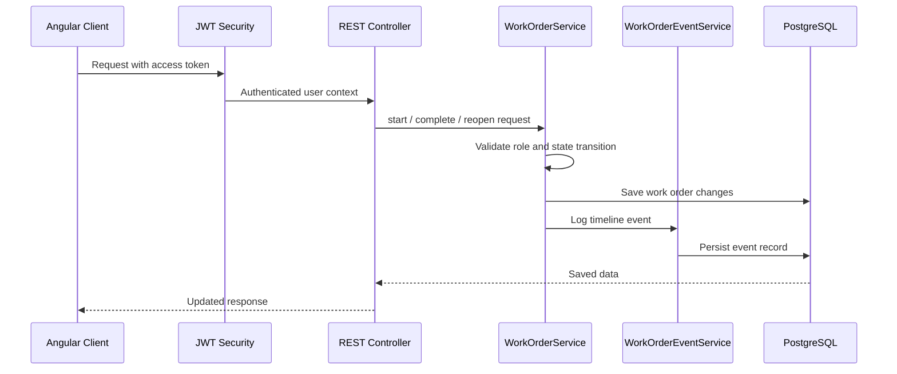
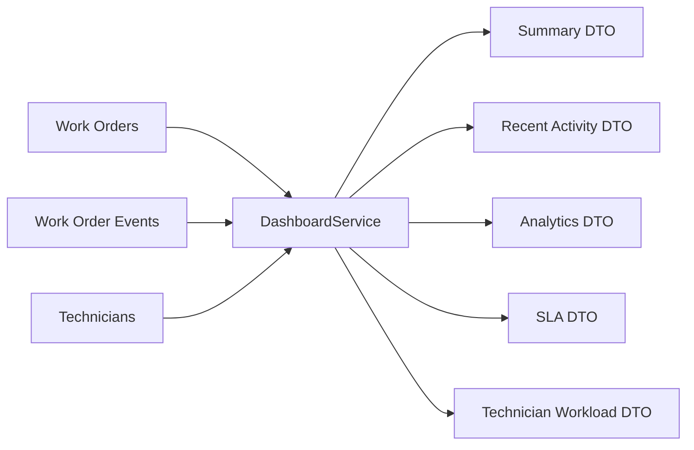

# A3 Field Service Management Backend

## Plain-English Overview

The backend is the rule engine of the A3 FSM platform.

It is responsible for:

- deciding what a user is allowed to do
- enforcing the work order lifecycle
- storing work orders, reports, attachments, and events
- powering the dashboard with operational and analytical data
- protecting data integrity even if the UI makes a bad request

In short: the frontend shows actions, but the backend is the final source of truth.

## How To Read This With The Root Diagrams

In the combined workspace, the root README is the visual entry point for the whole platform. Start there if you want the clearest picture of:

- the current-state architecture
- the future-state architecture direction
- the realtime assignment, completion, and SLA event flow

This backend README then zooms in on the server-side responsibilities that make those visuals real.

## Backend Highlights For Reviewers

This backend is a strong project talking point because it demonstrates more than endpoint creation:

- workflow enforcement lives on the server, not just in the UI
- timeline events make the system auditable and easier to reason about
- dashboard endpoints return frontend-friendly data instead of leaking raw database structure
- the design already hints at future service boundaries without over-engineering the current system

## What This Service Does

### Core Business Responsibilities

- authenticate users with JWT-based security
- create, update, assign, and track work orders
- allow technicians to start, document, and complete work
- enforce reopen and return-to-open rules
- capture timeline events for auditability
- generate dashboard summary, analytics, SLA, and workload data

### Why This Matters

For a field service platform, backend enforcement is critical because the user interface alone cannot guarantee process integrity.

Examples:

- a work order cannot be completed unless it is `IN_PROGRESS`
- a completed job cannot keep accepting normal technician edits
- only the assigned technician should be able to start work
- only admin or dispatch roles should be able to reopen completed work

## Service-Level Architecture Diagram



This is the backend slice of the broader current-state architecture shown in the root README.

## Main Architectural Layers

### Controller Layer

Receives HTTP requests and exposes REST endpoints for:

- authentication
- work orders
- attachments
- dashboard and analytics
- technician-related workflows

### Service Layer

Contains the real business logic:

- validates transitions
- checks role permissions
- coordinates report and timeline changes
- shapes dashboard data into frontend-friendly responses

### Repository Layer

Handles persistence using Spring Data JPA and PostgreSQL for:

- work orders
- users and technicians
- work order events
- structured completion reports
- attachments and related metadata

## Domain Flow Diagram



## Work Order Lifecycle Rules

The backend enforces the lifecycle so the application behaves consistently for every user and every client.



### Key Enforcement Rules

- `START` is only valid from `OPEN` or `ASSIGNED`
- `COMPLETE` is only valid from `IN_PROGRESS`
- `REOPEN` is only valid from `COMPLETED`
- `RETURN TO OPEN` is not allowed from `IN_PROGRESS`
- `RETURN TO OPEN` is not allowed from `COMPLETED`
- completion requires signature support
- duplicate completion report submission is blocked
- completed work orders are treated as read-only for normal technician edits

## Request Workflow Diagram



## Event Timeline Philosophy

The backend does not just save the latest state. It also records the story of what happened.

Important event types include:

- `CREATED`
- `STATUS_CHANGED`
- `ASSIGNED_TECHNICIAN`
- `UNASSIGNED_TECHNICIAN`
- `STARTED`
- `COMPLETED`
- `REOPENED`
- `NOTE_ADDED`
- `ATTACHMENT_ADDED`

This makes the system easier to audit, support, and eventually analyze for operational trends.

## Dashboard Responsibilities

The backend now powers three dashboard layers:

### Operational Summary

- KPI counts
- completed today
- high-priority open work
- recent activity messages shaped for the UI

### Analytics

- work orders by status
- work orders by priority
- completion trend

### SLA And Workload

- overdue work orders
- due-today work orders
- technician workload totals
- overdue and due-today workload pressure



## How The Root Visuals Map To Backend Responsibilities

The visual diagrams in the root README connect to this backend in three simple ways:

- current-state architecture: this backend owns the business rules, persistence, APIs, and server-side realtime behavior behind the Angular client
- future-state architecture: the services shown there reflect the clean boundaries already forming here around auth, work orders, SLA logic, dashboard aggregation, and notifications
- realtime business flow: assignment, completion, and SLA events all rely on backend validation, event logging, data updates, and broadcasting

## What To Emphasize In A Demo

If you are discussing the backend in a review or interview, the strongest points are:

- illegal workflow transitions are blocked at the service layer
- completion reporting is structured, not just free text
- dashboard intelligence is aggregated intentionally for UI consumption
- the current monolith is organized in a way that could evolve toward clearer service separation later

## Security Model

### Authentication

- JWT access tokens protect API requests
- refresh tokens support longer signed-in sessions
- role checks determine which endpoints and actions are allowed

### Role Intent

- `ADMIN`: highest level oversight and lifecycle recovery actions
- `DISPATCH`: assignment and operational coordination
- `TECHNICIAN`: execution, notes, completion, and field updates

## Role-Based Behavior In Practice

### Admin / Dispatch

- can reopen completed work orders
- can view broader dashboard and timeline visibility
- can manage assignments and operational recovery

### Technician

- can start assigned work
- can return eligible work to `OPEN`
- can submit notes, attachments, and structured completion
- cannot use admin-only recovery actions

## Local Development

### Run With Maven

```bash
./mvnw spring-boot:run
```

Typical local API base:

- `http://localhost:8080`

### Docker-Aware Notes

- the root `docker-compose.yml` wires this service to PostgreSQL and the Angular frontend
- uploads are mounted so files persist outside the container
- demo bootstrap support exists for container-first development
- a local database import helper is available when you want Docker to use existing local data

## API Direction

Representative endpoint groups include:

- `/api/auth/*`
- `/api/workorders/*`
- `/api/dashboard/summary`
- `/api/dashboard/recent-activity`
- `/api/dashboard/analytics`
- `/api/dashboard/sla`
- `/api/dashboard/technician-workload`

## Design Principles

This backend is designed around a few practical principles:

- business rules belong on the server
- dashboard endpoints should return UI-friendly data, not raw internal tables
- operational history should be explainable from timeline events
- new reporting features should build on clean DTOs rather than leaking persistence details

## Near-Term Evolution

As the platform moves further into Sprint 8 and beyond, the backend is well positioned for:

- real-time dashboard updates through WebSockets
- richer event-driven notifications
- technician-specific recent activity feeds
- deeper workload balancing and assignment intelligence
- future Kafka-based integration if scale and decoupling needs grow

## Related Documentation

- [Root README](../README.MD)
- [Frontend README](../A3%20Field%20Service%20Management%20Frontend/a3-fsm-frontend/README.md)

## Closing Summary

The backend gives the platform its operational discipline.

It is where:

- permissions are checked
- lifecycle rules are enforced
- evidence and reporting are stored
- dashboard intelligence is assembled

That makes it the part of the system that keeps the application trustworthy as the UI becomes more powerful and more real-time.
